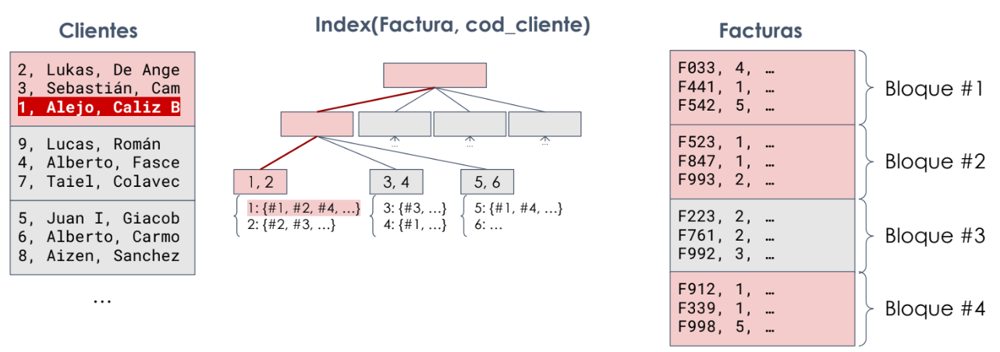

# Costos

Una consulta pasa por un SGBD y se convierte en una equivalente en AR para ejecutarse. En base a los metadatos que se encuentran en el catálogo, se elig ecomo resolver cada operador de AR, obteniendose el plan de ejecución.

Se busca que el costo de resolver la consulta sea el menor posible pero hay distintos costos

- Costo de acceso a disco
- Costo de procesamiento
- Costo de uso de memoria
- Costo de uso de redes

Nos enfocaremos únicamente en los costos de acceso a disco.

Interesa poder encontrar consultas equivalentes pero que nos den mejor performance.

## Equivalencias de operadores

### Selección

- Seleccionar todos con ands es lo mismo que concatenar selecciones.
- Seleccionar con ors internos es lo mismo que seleccionar de a uno e ir haciendo uniones.
- Seleccionar primero una clausula y luego otra es lo mismo que hacerlo al revés.

### Proyección

## Notación

- B(R): número de bloques ocupados por la relación R.
- n(R): número de tuplas de la relación R.
- V(A, R): número de valores distintos del atributo A en la relación R.
- F(R): cantidad de tuplas de R que entran en un bloque. 

$$
F(R) = \frac{n(R)}{B(R)}
$$

- Height(I(A, R)): altura del índice de búsqueda I por el atributo A de la relación R.
- Length(I(A, R)): Cantidad de bloques que ocupan las hojas del índice I.

## Índices

Se clasifican en distintos tipos:

- Cuando se construye sobre el campo de ordenamiento del archivo físico pero este no es clave, el índice se denomina **índice de clustering**.
- En caso de no estar ordenado será un índice no de clustering. También se suelen denominar **índices secundarios**.

- Cuando el índice de clustering se construye sobre el/los campo/s de clave primaria de un archivo ordenado de registros, se suele denominar **índice primario**.

## Operación de selección

- Búsqueda secuencial (file scan / busqueda lineal en el bloque):

$$
Costo = B(R)
$$

- Búsqueda por índice (índice de clustering):

$$
Costo = Height(I(A, R)) + \lceil \frac{B(R)}{V(A, R)} \rceil = Height(I(A, R)) + \lceil \frac{n(R)}{V(A, R) \cdot F(R)} \rceil
$$

Como el índice es de clustering, está ordenado igual que en la tabla, por lo cual la búsqueda va ser en cuanta cantidad de bloques esté el valor de la varianza, como lo asumimos uniforme dividimos directamente B(R) / V(A, R)

- Búsqueda por índice (índice secundario):

$$
Costo = Height(I(A, R)) + \lceil \frac{n(R)}{V(A, R)} \rceil
$$

Como el índice no es de clustering no podemos asumir que las filas están en bloques contiguos, por lo cual buscamos entre todas las rows de la relación divido la varianza, asumiendo de nuevo distribución uniforme.

- Búsqueda por índice (índice primario):

$$
Costo = Height(I(A, R)) + 1 
$$ 

En este caso, la división anterior da 1 porque la cantidad de tuplas y variabilidad de la PK son iguales.

Si la selección involucra la conjunción de varias condiciones simples:

- Si uno de los atributos tiene un índice asociado, se aplica primero esta condición, y luego se selecciona del resultado a aquellas tuplas que cumplen con las demás condiciones.
- Si hay un índice compuesto que involucra a atributos de más de una condición, se utiliza esta índice y luego se seleccionan las tuplas que cumplen los demás criterios.
- Si hay índices simples para varios atributos, se utilizan los índices por separado y luego se intersecan los resultados.

Si la selección involucra una disyunción de condiciones simples, debemos aplicar las mismas por separado y luego unir los resultados.

- Si uno de los atributos no dispone de índice, hay que usar fuerza bruta.

Para mejorar la estimación, se utilizan histogramas que guardan la frecuencia de los valores que tiene cada columna, a veces los N más frecuentes. Útil para valores discretos y con repeticiones.

### Estimación de la cardinalidad

$$
n(\sigma(R)) = \lceil \frac{n(R)}{V(A, R)} \rceil
$$

Si se tiene histograma y se conoce el valor se lo utiliza.

Si tiene pero no se conoce se hace

n(R) : total - sum(frecuencias conocidas)

V(A, R): se le resta la cantidad de frecuencias conocidas 

### Estimación cantidad de bloques

$$
B(\sigma(R)) = \lceil \frac{n(\sigma(R))}{F(R)} \rceil
$$

## Operacion de join

### Tipos de joins

#### Loops anidados por bloque

Si tengo en memoria un bloque de R y un bloque de S, puedo hacer el join entre todas las filas de esos bloques.

Si tengo M bloques de memoria, el costo entonces está dado por 

$$
Cost(R \bowtie S) = B(R) + \lceil \frac{B(R)}{M - 2} \rceil \cdot B(S)
$$

siendo R más chico que S (mejora el costo hacerlo así)

Mínimo voy a necesitar 3 bloques de memoria! Uno para el bloque de R, otro para el bloque de S y uno para ir poniendo los resultados parciales.

El método carga secuencialmente chunks de la tabla más chica y realiza un loop contra todos los bloques de la tabla más grande.

#### Loop con único índice

Cuando la condición es de igualdad y una tabla S tiene un índice sobre los campos de la condición, puede llegar a aprovecharse ese índice.

Se recorre bloque a bloque la otra tabla (R) y para cada fila se hace un index scan en la tabla con índice (S)

Si hay índice en ambas tablas se debe ver si conviene empezar por una o la otra (no se puede usar ambos a la vez)

El costo depende de si el índice es o no de clustering.

Si se usa el índice I sobre el atributo A de la tabla S y no es de clustering, el costo es

$$
Costo(R \bowtie S) = B(R) + n(R) \cdot [Height(I(A, S)) + \lceil \frac{n(S)}{V(A, S)} \rceil]
$$

En cambio si el índice es de clustering

$$
Costo(R \bowtie S) = B(R) + n(R) \cdot [Height(I(A, S)) + \lceil \frac{B(S)}{V(A, S)} \rceil]
$$

#### Sort Merge

Cuando la condición es de igualdad y las tablas están ordenadas físicamente por los atributos de la condición se puede ir procesando bloque a bloque

Cuando el valor de los atributos de junta coincide, se hace el join entre todos. Cuando no coinciden, se avanza el de menor valor sin combinarlo.

El costo sería B(R) + B(S), se lee bloque a bloque ambas tablas.

Para ellos se debe poder tener todos los bloques de ambas tablas que tienen un mismo valor en los atributos de la condición de junta; la memoria necesaria se calcula como 

$$
M >= \lceil \frac{B(R)}{V(A, R)} \rceil + \lceil \frac{B(S)}{V(A, S)} \rceil + 1
$$

Como en general las tablas no están ordenadas, podemos calcular el costo de sort-merge como:

    - Ordenar la tabla R y guardar el resultado
    - Ordenar la tabla S y guardar el resultado
    - Leer los resultados ordenados y procesar el join
    
Si alguna estuviera ordenada, se ahorra el costo de ordenar y de grabar a disco.

Costo total entonces es

$$
Cost(R \bowtie S) = Cost(Ord_{M}(R)) + Cost(Ord_{M}(s)) + B(R) + B(S)
$$

Siendo el costo de ordenar calculado como:

$$
Cost(Ord_{M}(R)) = 2 \cdot B(R) \cdot \lceil log_{M-1}(B(R)) \rceil
$$

#### Junta Hash Grace

En la primera etapa se divide ambas tablas en n particiones.

Se lee bloque a bloque cada tabla, y fila a fila se agrega al bloque de la partición que le corresponde.

Cuando se lelna un bloque de partición, se graba

El costo es de escribir y leer ambas tablas: $$2 \cdot (B(R)+B(S))$$

En la segunda etapa, se procesa la primera partición:

    - se efectúa join por loops anidados entre ambas particiones de cada tabla
    
Se repite para las otras n-1 particiones

    - se lee, en total B(R) + B(S) bloques entre todas

$$
Costo(R \bowtie S) = 3 * (B(R) + B(S))
$$

### Límites

Primer límite: $$P <= M - 1$$
Segundo límite: $$min(\lceil(\frac{B(R)}{P})\rceil;\lceil(\frac{B(S)}{P})\rceil) <= M - 2$$
Tercer límite: $$min(V(A, R); V(A, S)) >= P$$

### Cardinalidad

Cardinalidad de join sin histograma:

$$
n(R \bowtie S) = \frac{n(R) \cdot n(S)}{max(V(A,R) , V(A,S))}
$$

Cardinalidad de join sin histograma por más de un campo:

$$
n(R \bowtie S) = \frac{n(R) \cdot n(S)}{max(V(A1,R) \cdot V(A2,R), V(A1,S) \cdot V(A2,S))}
$$

Cardinalidad con histogramas:

Si sabemos n y V de cada pais vamos a poder calcular cuanto cuesta la junta y ya

Para lo que no sean partes del histograma hacemos un otros restando lo que sabemos y ya.

### Cantidad de bloques 

$$
F(R \bowtie S) = \left\lfloor \frac{1}{\frac{1}{F(R)} + \frac{1}{F(S)}} \right\rfloor
$$

$$
B(R \bowtie S) = \frac{n(R \bowtie S)}{F(R \bowtie S)}
$$

## Operación de proyección

Si la consulta no tiene DISTINCT o si se proyecta por una superclave, no es necesario eliminar nada entonces

$$
Costo(\pi (R)) = B(R)
$$

Si hay que eliminar duplicados, se utiliza un sort externo para que dsp al venir en orden, eliminar los duplicados es simplemente quedarse con el primero de los valores.

$$
\text{Cost}(B(\pi_{A}(R))) = 2 \cdot B(\pi_{A}(R)) + \lceil \log_{M-1}(B(\pi_{A}(R))) \rceil - 2 \cdot B(\pi_{A}(R)) + B(R)
$$

### Estimación de cardinalidad

*Si no eliminamos duplicados*

$$
n(\pi(R)) = n(R)
$$

*Si eliminamos duplicados, podemos estimar según las variabilidades:*

$$
n(\pi_{A_1}(R)) = V(A_1, R)
$$

$$
n(\pi_{A_1, A_2}(R)) = V(A_1, R) \cdot V(A_2, R)
$$

si no hay correlación entre los atributos

### Estimación de cantidad de bloques

$$
F(\pi_{A1}(R)) = \frac{F(R) \cdot \text{tam(fila)}}{\text{tam(col)}}
$$

$$
B(\pi_{A1}(R)) = \frac{B(R) \cdot \text{tam(col)}}{\text{tam(fila)}}
$$

## Operaciones de conjuntos

Se deben trabajar con ambas tablas ordenadas

$$
\text{Cost}(R \cup / \cap / -\ S) = \text{Cost}(Ord_{M}(R)) + \text{Cost}(Ord_{M}(S)) + B(R) + B(S)
$$

Estimar la cardinalidad es díficil ya que no se conoce la cardinalidad de la intersección

En la unión debería restarse de n(R) + n(S)

En la resta debería restarse de n(R)

## Pipelining

Siempre conviene arboles left deep, es decir que lo de la derecha antes de "unirse" a la izquierda solo sea levantar una tabla.

