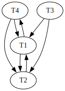

1. 

Opción I:

```
SELECT p.cod_art, p.precio
FROM Precios p
WHERE p.fecha_desde = (
    SELECT MAX(p.fecha_desde)
    FROM Precios p2
    WHERE p2.fecha_desde <= '13-05-2021'
        AND p.cod_art = p2.cod_art
)
```

Opción II:

```
WITH s AS (
    SELECT 
        p.cod_art, 
        MAX(p.fecha_desde) AS last_date
    FROM 
        Precios p
    WHERE 
        p.fecha_desde <= '13-05-2021'
    GROUP BY 
        p.cod_art
)

SELECT 
    p.cod_art, 
    p.precio
FROM 
    precios p2
INNER JOIN
    s ON 
        p.cod_art = s.cod_art 
        AND 
        p.fecha_desde = s.last_date;
```

2. a.

$$
I1 \rightarrow N3
$$
$$
I2 \rightarrow N2
$$
$$
I3 \rightarrow N1
$$

b. Si se cae el nodo 1, tenemos que pasar los nodos que pertenecian a N1 a N3, y aquellos que estaban de "resguardo" en N3 pasan a estar en N2.

3.

```
MATCH(u1:User)-[:WORKS_IN]->(c:Company)<-[:WORKS_IN]-(u2.username)
WHERE u2.username > u1.username
WITH u1, u2, COUNT(DISTINT c) AS cantidad_empresas
WHERE cantidad_empresas >= 3
WITH u1, u2
MATCH(u1)-[:KNOWS]->(u3:User)<-[:KNOWS]-(u2)
WITH u1, u2, COUNT(DISTINCT u3) AS cantidad_conocidos
WHERE cantidad_conocidos >= 5
RETURN u1, u2
```

4.

```
01 (BEGIN, T1);
02 (BEGIN, T2);
03 (WRITE, T1, A, 10, 14);
04 (WRITE, T2, B, 5, 8);
05 (COMMIT, T1);
06 (BEGIN CKPT, T2);
07 (BEGIN, T3);
08 (WRITE, T3, D, 18, 20);
09 (WRITE, T2, C, 22, 50);
10 (COMMIT, T2);
11 (END CKPT);
12 (BEGIN, T4);
13 (WRITE, T4, A, 14, 30);
14 (WRITE, T4, B, 8, 10);
```

Primero hago UNDO de abajo hacia arriba

Veo a T4 sin commit -> voy a terminar abortando

B -> 8

A -> 14

Veo commit de T2, ignoro lo que vea de ella

Veo a T3 sin commit -> voy a terminar abortando

D -> 18

Veo el inicio del ckpt, no miro más arriba, y T2 de por sí ya commiteo asique mucho no me servía tampoco.

Hago REDO ahora de aquellas transacciones que hayan commiteado a partir del CHKPT (solamente T2) ->

C -> 50

Se deberá retroceder entonces hasta la línea 06 del log. Se deberá hacer flush a disco de todo tras la recuperación, y en el log se deben sumar además

(ABORT, T3)

(ABORT, T4)

5.

```
SELECT 
    c.*
FROM
    Clientes c
    INNER JOIN 
        Prestamos_vencidos p 
            ON c.DNI = p.DNI
```

Busco junta por único indice, tendria que analizar cual de los dos me conviene más. Veo que el indice de prestamos vencidos cuesta menos, y el resto de números me hacen creerlos, además que es de clustering.

$$
Costo(c \bowtie p) = B(c) + n(c) \cdot [Height(I(DNI, p)) + \lceil \frac{B(p)}{V(DNI, p)} \rceil] 
$$
$$
Costo(c \bowtie p) = 500.000 + 5.000.000 \cdot [2 + \lceil \frac{1.000}{5.000} \rceil] = 500.000 + 5.000.000 \cdot [2 + 1] = 15.500.000
$$

Veo un costo alto asique pruebo al reves, porque ya de por sí sort merge sería mejor porque seria 
$$
3 \cdot (B(c)+B(p))
$$ 

Calculo entonces

$$
Costo(c \bowtie p) = B(p) + n(p) \cdot [Height(I(DNI, c)) + \lceil \frac{n(c)}{V(DNI, c)} \rceil]
$$
$$
Costo(c \bowtie p) = 1.000 + 10.000 \cdot [4 + \lceil \frac{5.000.000}{5.000.000} \rceil] = 1.000 + 10.000 \cdot [4 + 1] = 1.000 + 10.000 \cdot 5 = 51.000
$$

Veo que es mejor que cualquier otro metodo porque es menor a B(c) + B(p)

6. a.



b. El solapamiento no es serializable porque el grafo de precedencias no es un DAG

c. Para que el solapamiento sea recuperable, quiero que las transacciones que hayan leido un dato modificado, commiteen después que las transacciones que modificaron.

En la primera lectura, $T3$ lee $Y$ y a nadie la modificó antes, no va generar un problema. 

En la segunda lectura $T1$ lee $Y$ que fue modificado por $T2$, pero como $T2$ commitea antes que $T1$, tampoco hay un problema aca.

Finalmente en la tercer lectura $T4$ lee $X$, que fue modificado por la propia $T4$, no genera problemas; fue modificado por $T1$ y $T2$ también y ambas commitean antes que $T4$, por lo cual no hay problemas.

Concluimos entonces que el solapamiento es recuperable.