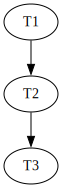

1.

```
MATCH(p1:Persona)-[t:TRABAJA_EN]->(e:Establecimiento)
WITH p1, e
MATCH (p1)-[:HIJO_DE*]-(p2:Persona)-[t2:TRABAJA_EN]->(e)
WHERE t1.ingreso < t2.ingreso
WITH p1, p2, COUNT(DISTINCT p2) AS cantidad_familiares
WHERE cantidad_familiares >= 3
RETURN p1
```

2.

a.



b. El solapamiento es serializable porque no se forma un DAG.

c. Para el que el solapamiento sea recuperable las transacciones que lean un dato previamente modificado, deben commitear después que las transacciones que cambiaron dicho dato.

Busco entonces las lecturas:

$R_{T2}(Y)$: antes $Y$ fue modificado por $T1$ => $T1$ tiene que commitear antes que $T2$

$R_{T3}(Z)$: nadie modificó antes a $Z$

Entonces con agregar al final algunas de estas opciones: 

$C_{T1}$, $C_{T2}$, $C_{T3}$

$C_{T3}$, $C_{T1}$, $C_{T2}$

$C_{T1}$, $C_{T3}$, $C_{T2}$

aseguramos que el solapamiento es recuperable.

3. Como no hay una selección previa ni nada que me pueda hacer descartar datos antes lo único que puedo hacer es


El costo da entonces

$$
Costo(Partidos \bowtie Partidos) = 3 \cdot (B(P) \cdot 2) = 6 \cdot B(P) = 6000
$$

Calculando la minima cantidad de bloques

$$
\frac{B(p)}{M-1} = M - 2 \rightarrow B(P) = (M - 2) \cdot (M - 1) = M^{2} - M - 2M  + 2 = M^{2} - 3M + 2 
$$

$$
M_{1} = -76,48; M_{2} = 77,007
$$

$M_{1}$ lo descarto por ser un numero negativo, me quedo con $M_{2}$ y redondeo hacia arriba porque voy a necesitar 77 bloques y parte de un 78° bloque, asique respuesta final $$M = 78$$.

4.

```
SELECT DISTINCT(p.nombre), p.precio
FROM Platos p 
WHERE NOT EXISTS (
    SELECT 1
    FROM Composicion c
    JOIN Ingredientes i ON c.id_ingrediente = i.id_ingrediente
    WHERE c.codigo_plato = p.codigo_plato
    AND (i.tipo = 'Animal' OR 
        i.tipo = 'Derivado de animal')
)
```

5.

```
db.museos.aggregate([
    {
        $unwind: "$piezas"
    }, 
    {
        $match: {
            especie: "Tyrannosaurus Rex",
            "piezas.tipo_pieza": "real"
        }
    },
    {
        $sort: {
            "piezas.largo_cm": -1
        }
    },
    {
        $limit: 1
    },
    {
        $project: {
            _id: 0,
            nombre_museo: 1,
            especie: 1,
            pieza: "$piezas.nombre",
            largo_cm: "$piezas.largo_cm",
            tipo_pieza: "$piezas.tipo_pieza"
        }
    }
])
```


6.

```
01 (BEGIN, T1);
02 (WRITE T1, A, 10);
03 (BEGIN, T2);
04 (WRITE T2, B, 5);
05 (COMMIT, T1);
06 (BEGIN, T3);
07 (WRITE T3, A, 20);
08 (BEGIN CKPT, T2, T3);
09 (BEGIN, T4);
10 (WRITE T4, C, 30);
11 (END CKPT);
12 (COMMIT, T2);
13 (WRITE T4, B, 44);
14 (COMMIT, T4);
```

REDO miro de atrás hacia adelante y rehago todas las transacciones que commitearon

Primero veo que las que no commitearon es únicamente T3

Veo un Begin CKPT que tiene un END CKPT por lo cual vuelvo al begin de la transacción más vieja del ckpt (T2)

Desde la línea 3 entonces hago REDO solo de las transacciones que commitearon:

B <- 5
C <- 30
B <- 44

Mando todo a disco, y como T3 no commiteo agrego al final del log

(ABORT, T3)