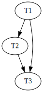

1.

Opción I:

```
SELECT r.cod_repartidor, r.nombre
FROM Repartidores r
    INNER JOIN 
        Envios e 
            ON r.cod_repartidor = e.cod_repartidor
WHERE e.barrio = 'Palermo' 
    AND r.cod_repartidor NOT IN (
        SELECT e2.cod_repartidor
        FROM Envios e2
        WHERE e2.barrio = 'Recoleta' OR e2.barrio = 'Belgrano'
    )
```

Opción II:

```
SELECT r.cod_repartidor, r.nombre
FROM Repartidores r
    INNER JOIN 
        Envios e 
            ON r.cod_repartidor = e.cod_repartidor
WHERE e.barrio = 'Palermo' 

EXCEPT

SELECT r.cod_repartidor, r.nombre
FROM Repartidores r
    INNER JOIN 
        Envios e 
            ON r.cod_repartidor = e.cod_repartidor
WHERE e.barrio in ('Recoleta', 'Belgrano') 
```

2.

Estimo valor de 1 para S.a:

$$
n(\sigma_{A=1}(S)) = \lceil \frac{n(S)}{V(A, S)} \rceil = \lceil \frac{5000-1000-700-500}{23-3} \rceil
$$

$$
n(\sigma_{A=4}(R)) = \lceil \frac{2800}{20} \rceil = \lceil 140 \rceil = 140
$$

Estimo valor de 4 para R.a:

$$
n(\sigma_{A=4}(R)) = \lceil \frac{n(R)}{V(A, R)} \rceil = \lceil \frac{8000-1000-700-500}{23-3} \rceil
$$

$$
n(\sigma_{A=4}(R)) = \lceil \frac{5800}{20} \rceil = \lceil 290 \rceil = 290
$$

Luego para el resto de valores, hago la suposición de que los numeros son todos mayores a 1. Por lo cual al momento de hacer la selección en $R.a > 4$ voy a tener $8.000-1000-700-500-290=5.510$ y en $S.a > 4$ voy a tener $5.000-140-1.000-700-500=2.660$

Estimo la cardinalidad  como, la suma de los $[R.a=S.a=2] + [R.a=S.a=3] + [R.a=S.a=4] + [R.a=S.a>4]$

$$
n(S \bowtie R) = [R.a=S.a=2] + [R.a=S.a=3] + [R.a=S.a=4] + [R.a=S.a>4]
$$

$$
n(S \bowtie R) = 700 \cdot 1000 + 500 \cdot 700 + 290 \cdot 500 + 5.510 \cdot 2.660
$$

$$
n(S \bowtie R) =  15.851.600
$$

3.

a.

Para que el solapamiento sea recuperable, las transacciones que leen datos modificados previamente por otra transacción, deben commitear posterior a la transacción que modificaron el dato.

Busco entonces las lecturas:

$R_{T1}(X)$: nadie realizó ninguna operación antes, no genera problemas.

$R_{T3}(X)$: antes $T_{2} escribió en $X$ $\rightarrow$ $T_{2}$ tiene que commitear antes que T3.

$R_{T3}(Z)$: antes $T_{1} escribió en $Z$ $\rightarrow$ $T_{1}$ tiene que commitear antes que T3.

Entonces una forma de agregar los commits de forma tal que el solapamiento sea recuperable es agregando al final:

$$
C_{T1}, C_{T2}, C_{T3}
$$

b. Para que no sea recuperable basta con que $T_{3}$ commitee antes que $T_{1}$ o $T_{2}$ (o antes que ambas). Propongo entonces

$$
C_{T3}, C_{T1}, C_{T2}
$$

c. Para que el solapamiento sea serializable el grafo de precedencias NO debe ser un DAG.



No se forma un DAG por lo cual el solapamiento es serializable.

4.

```
db.enfermedades.aggregate([
    {
        $match: {
            "año": 2024
        }
    },
    {
        $unwind: "$casos"
    },
    {
        $group: {
            _id: {
                provincia: "$cod_provincia"
                enfermedad: "$casos.enfermedad"
                
            },
            cantidad_casos: {
                $sum: 1
            }
        }
    }, {
        $match: {
            cantidad_casos: {$gt: 50}
        }
    },
    {
        $group: {
            _id: "$id.provincia",
            cant_enfermedades: {
                $sum: 1
            }
        }
    },
    {
        $match: {
            cant_enfermedades: {$gte: 3}
        }
    },
    {
        $project: {
            _id: 0,
            cod_provincia: "$_id"
        }
    }
])
```

5.

```
MATCH(c1:Cancion), (c2:Cancion)
WHERE (c1.nombre < c2.nombre OR 
    (c1.nombre=c2.nombre AND c1.banda < c2.banda)) 
    AND NOT EXISTS {
        MATCH(:Jugador)-[:NO_SOPORTA]->(c1)
    } AND NOT EXISTS {
        MATCH(:Jugador)-[:NO_SOPORTA]->(c2)
    }
WITH c1, c2
MATCH (j:Jugador)
WHERE (j)-[:LE_GUSTA]->(c1) OR (j)-[:LE_GUSTA]->(c2)
WITH c1, c2, collect(DISTINCT j) AS jugadores
RETURN c1, c2
ORDER BY size(jugadores) DESC
LIMIT 1
```

6.

```
01 (BEGIN, T1);
02 (WRITE T1, A, 1);
03 (COMMIT, T1);
04 (BEGIN, T2);
05 (WRITE T2, B, 5);
06 (BEGIN, T3);
07 (BEGIN CKPT, T2, T3);
08 (WRITE T3, C, 10);
09 (COMMIT, T3);
10 (BEGIN, T4);
11 (WRITE T4, D, 15);
12 (END CKPT);
13 (COMMIT, T4);
```

Tenemos un checkpoint con su end ckpt por lo cual sabemos que todo lo modificado previo al BEGIN CKPT fueron flusheados a disco.

Por lo cual en disco tenemos:

A <- 1

Luego vemos que C y D fueron escritos por $T_{3}$ y $T_{4}$ y que han commiteado ambas, pero de todas formas, no tenemos seguridad de que hayan sido flusheados a disco. Como el sistema produjo una falla, tenemos que pueden en disco estar C con valor 0 (inicial) o 10 (escrito por $T_{3}$), D con valor 0 (inicial) o 15 (escrito por $T_{4}$). Finalmente como de T2 no tenemos COMMIT, la vamos a tener que abortar, por lo cual en el valor B va seguir estando el valor 0.