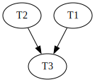

1.

```
WITH a AS (
    SELECT COUNT(DISTINCT nombre_torneo) AS torneos_grand_slam
    FROM Torneos
    WHERE tipo_torneo = 'Grand Slam'
)

SELECT 
    c.nombre_campeon
FROM 
    Campeones c
    INNER JOIN 
        Torneos t 
            ON c.nombre_torneo = t.nombre_torneo
    CROSS JOIN 
        a
WHERE 
    tipo_torneo = 'Grand Slam'
GROUP BY 
    c.nombre_campeon
HAVING 
    COUNT(DISTINCT c.nombre_torneo) >= a.torneos_grand_slam
```

2.

Datos:

```
N1: 59
N2: 160
N3: 120
N4: 235
```

Respuesta:

a.

```
I1: 100 -> va al nodo N3
I2: 130 -> va al nodo N2
I3: 240 -> va al nodo N1
```

b.

Si se cae el nodo N1 todo lo que estába en él va pasar a estar en N3, y todo lo que estaba guardado de "resguardo" en N3, que realmente pertenencía a N1, se pasa a N2.

3.

```
db.encuestas.aggregate([
    {
        $unwind: "$encuestas"
    },
    {
        $group: {
            _id: {
                cod_provincia: "$cod_provincia",
                provincia: "$provincia",
                nombre_hospital: "$nombre_hospital",
                direccion: "$direccion"
                // asumo que puedo tener más de un hospital con el mismo nombre en la misma provincia, uso todo esto como key del group para evitar juntar casos como el descripto.
            },
            promedio_hospital: {$avg: "$encuestas.puntaje"}
        }
    }, // obtengo el promedio por hospital primero
    {
        $group: {
            _id: {
                cod_provincia: "$_id.cod_provincia",
                nombre_provincia: "$_id.provincia"
            },
            cant_hospitales_promedio: {
                $sum: {
                    $cond: [ { $lt: ["$promedio_hospital", 5] }, 1, 0 ]
                }
            }
        } // agrupo por provincia y voy contando la cantidad de hospitales con promedio menor a 5 que hay en esa provincia
    },
    {
        $match: {
            "cant_hospitales_promedio": {
                $eq: 0
            }
        }
    }, // descarto aquellos hospitales que tienen algun hospital con promedio menor a 5
    {
        $project: {
            _id: 0,
            cod_provincia: "$_id.cod_provincia",
            provincia: "$_id.provincia"
        }
    } // proyecto únicamente los datos que me importan, capaz solo mostrando el id es lo mismo, idk
])
```

4.

$$
b_{T1} ; R_{T1}(X) ; b_{T2} ; W_{T2}(Y) ; b_{T3} ; R_{T3}(X) ; W_{T3}(X) ; R_{T3}(Y)
$$

a.

Para que el solapamiento sea recuperable las transacciones que lean un dato modificado previamente por otra transacción, deben commitear después que la transacción "modificadora". 

Busco lecturas entonces:

$R_{T1}(X)$: Nadie realiza ninguna operación antes, no genera ningún problema.

$R_{T3}(X)$: Solo $T_{1}$ realizó una lectura antes, no genera ningún problema tampoco.

$R_{T3}(Y)$: La transacción $T_{2}$ modificó a $Y$ $\rightarrow$ $T_{2}$ debe commitear antes que $T_{3}$

Por lo cual cualquier orden de commits en los que el commit de $T_{2}$ anteceda al commit de $T_{3}$; propongo uno cualquiera que cumpla con esto

$$
C_{T1}, C_{T2}, C_{T3}
$$

b. Acá podría probar todas las combinaciones posibles de lectura/escritura por transacción y por item pero prefiero directamente armar el grafo de precedencias, y mirar qué aristas debería agregar para formar un DAG, logrando que el solapamiento **deje** de ser serializable.



Como se puede ver de agregar conflictos entre T2 y T1 no puedo agregar una única lectura o escritura que genere que el grafo sea un DAG, por lo cual podría agregar al final:

$R_{T1}(Y)$: Agrega arista de T2 a T1, **sigue siendo serializable**.
$R_{T2}(Y)$: No agrega ninguna arista pues quien modifica a $Y$ es T2 misma, **sigue siendo serializable**.
$R_{T3}(Y)$: No agrega ninguna arista pues ya existe de T2 a T3 por la lectura, **sigue siendo serializable**.
$W_{T1}(Y)$: Agrega arista de T2 a T1, **sigue siendo serializable**.
$W_{T2}(Y)$: Agrega una arista de T3 a T2 $\rightarrow$ se forma un ciclo $\rightarrow$ **deja de ser serializable**.
$W_{T3}(Y)$: No agrega ninguna arista pues ya existe de T2 a T3 por la lectura, **sigue siendo serializable**.

$R_{T1}(X)$: Agrega una arista de T3 a T1 $\rightarrow$ se forma un ciclo $\rightarrow$ **deja de ser serializable**.
$R_{T2}(X)$: Agrega una arista de T3 a T2 $\rightarrow$ se forma un ciclo $\rightarrow$ **deja de ser serializable**.
$R_{T3}(X)$: No agrega ninguna arista pues quien modifica a $X$ es T3 misma, **sigue siendo serializable**.
$W_{T1}(X)$: Agrega una arista de T3 a T1 $\rightarrow$ se forma un ciclo $\rightarrow$ **deja de ser serializable**.
$W_{T2}(X)$: Agrega una arista de T3 a T2 $\rightarrow$ se forma un ciclo $\rightarrow$ **deja de ser serializable**.
$W_{T3}(X)$: No agrega ninguna arista, **sigue siendo serializable**.

5.

Tengo M = 12.

No puedo aplicar junta por índices, voy a tener que buscar con los otros métodos de junta.

Busco descartar los métodos con restricciones primero:

Para sort merge se tiene que cumplir que:

$$
M >= \lceil \frac{B(R)}{V(A, R)} \rceil + \lceil \frac{B(S)}{V(A, S)} \rceil + 1
$$

Reemplazando con los datos

$$
12 >= \lceil \frac{1.000}{100} \rceil + \lceil \frac{2.000}{50} \rceil + 1
$$

$$
12 >= \lceil 10 \rceil + \lceil 40 \rceil + 1 \rightarrow 12 < 51
$$

No se cumple la restricción, no puedo ordenar en memoria, busco costo ordenado con sort externo

$$
Cost(Empresas \bowtie Vendedores) = Cost(Ord_{M}(R)) + Cost(Ord_{M}(S)) + B(R) + B(S)
$$

$$
Cost(Empresas \bowtie Vendedores) = 2 \cdot B(R) \cdot \lceil log_{M-1}(B(R)) \rceil + 2 \cdot B(S) \cdot \lceil log_{M-1}(B(S)) \rceil + B(R) + B(S)
$$

$$
Cost(Empresas \bowtie Vendedores) = 2 \cdot 1.000 \cdot \lceil log_{11}(1.000) \rceil + 2 \cdot 2.000 \cdot \lceil log_{11}(2.000) \rceil + 1.000 + 2.000
$$

$$
Cost(Empresas \bowtie Vendedores) = 2.000 \cdot \lceil 2,88 \rceil + 4.000 \cdot \lceil 3,16 \rceil + 1.000 + 2.000
$$

$$
Cost(Empresas \bowtie Vendedores) = 2.000 \cdot 3 + 4.000 \cdot 4 + 1.000 + 2.000 = 25.000
$$

Busco las restricciones de junta hash-grace:

$$
P <= M - 1 \wedge min(\lceil \frac{B(R)}{P} \rceil; \lceil \frac{B(S)}{P} \rceil) <= M - 2
$$

Como $P = M - 1$ el menor entre las dos divisiones será el de $B(listadoEmpresas)$. Reemplazo los datos

$$
\lceil \frac{1.000}{M - 1} \rceil <= M - 2
$$

$$
\lceil \frac{1.000}{11} \rceil <= 10
$$

$$
\lceil 90,9 \rceil > 10
$$

No puedo aplicar hash grace.

Aplico entonces Loops anidados por bloque:

$$
Cost(R \bowtie S) = B(R) + \lceil \frac{B(R)}{M - 2} \rceil \cdot B(S)
$$

$$
Cost(Empresas \bowtie Vendedores) = 1.000 + \lceil \frac{1.000}{10} \rceil \cdot 2.000
$$

$$
Cost(Empresas \bowtie Vendedores) = 1.000 + \lceil 100 \rceil \cdot 2.000 = 201.000
$$

Entonces como veo que el costo de sort merge es mejor, me quedo con él concluyendo entonces:

$$
Cost(Empresas \bowtie Vendedores) = 25.000
$$

Calculando ahora la cantidad de filas que serán devueltas:

$$
n(R \bowtie S) = \frac{n(R) \cdot n(S)}{max(V(A,R) , V(A,S))}
$$

$$
n(Empresas \bowtie Vendedores) = \frac{10.000 \cdot 50.000}{max(100 , 50)}
$$

$$
n(Empresas \bowtie Vendedores) = \frac{10.000 \cdot 50.000}{100} = \frac{500.000.000}{100} = 5.000.000
$$

6.

```
01 (BEGIN, T1);
02 (WRITE T1, A, 1);
03 (COMMIT, T1);
04 (BEGIN, T2);
05 (WRITE T2, A, 2);
06 (BEGIN, T3);
07 (BEGIN CKPT, T2, T3);
08 (WRITE T3, C, 3);
09 (COMMIT, T3);
10 (BEGIN, T4);
11 (WRITE T4, D, 4);
```

T1 y T3 commitearon, T2 y T4 no. No hay un END CKPT, solo miro hasta 04 porque son las activas en el BEGIN CKPT

```
A <- 2
D <- 4
```

Deshago solo las operaciones de aquellas transacciones que no commitearon (T2 y T4). 

Finalmente en el log agrego 

```
(ABORT, T2)
(ABORT, T4)
```

y vuelco todo a disco

