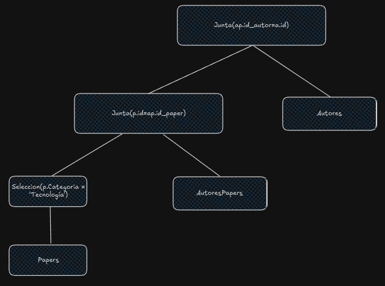

1.

```
WITH fecha_mas_joven AS (
    SELECT id_socio
    FROM Socios
    WHERE fecha_nacimiento = (
        SELECT MAX(fecha_nacimiento)
        FROM Socios
    ) 
), fecha_mas_viejo AS (
    SELECT id_socio
    FROM Socios
    WHERE fecha_nacimiento = (
        SELECT MIN(fecha_nacimiento)
        FROM Socios
    ) 
)

SELECT nombre_pelicula
FROM SocioAdoraPelicula
WHERE id_socio = (SELECT id_socio FROM fecha_mas_joven)

INTERSECT

SELECT nombre_pelicula
FROM SocioAdoraPelicula
WHERE id_socio = (SELECT id_socio FROM fecha_mas_viejo)
```

2.

```
db.linked_out.aggregate([
    {
        $unwind: "$conocimientos"
    }, // desacoplo conocimientos, voy a tener varias veces al usuario
    {
        $match: {
            conocimientos: "SQL"
        }
    }, // pero como aca solo matcheo con una sola cosa (SQL en este caso), no voy a tener repetidos los following de cada usuario, todo OK
    {
        $unwind: "$sigueA"
    }, // desacoplo por seguidos para sumar los segudiores
    {
        $group: {
            _id: "$sigueA.cuenta",
            followers: {$sum: 1}
        }
    },
    { // agrupo por cuenta seguida, contando cuantas veces aparece (es decir, cuantos seguidores tiene)
        $sort: {
            followers: -1
        }
    },
    {
        $limit: 5
    },
    {
        $project: {
            _id: 1,
            followers: 1
        }
    }
])
```

3.

```
MATCH(c1:Cancion)-[:PERTENECE_A]->(b1:Banda{nombre:"Eruca Sativa"}),
        (c1)-[:ES_DE]->(g1:Genero)
WITH c1, g1 // tengo las canciones de Eruca Sativa y todos los géneros que tocó la banda
MATCH(c2:Cancion)-[:PERTENECE_A]->(b2:Banda)
WHERE b2.nombre <> "Eruca Sativa"
WITH c1, g1, c2, b2
MATCH (c2)-[:ES_DE]->(g1) // busco canciones de una banda distinta a 'Eruca Sativa' que se asocie a algún genero que toco 'Eruca Sativa'
WITH c1, c2, b2
MATCH (u:Usuario)-[:LE_GUSTA]->(c2),
    (u)-[:LE_GUSTA]->(c1) // me fijo usuarios que les guste canciones de esa banda y que tmb le guste algun tema de Eruca Sativa
WITH b2, COUNT(DISTINCT(u)) AS likes
RETURN b2.nombre AS banda, likes
ORDER BY likes DESC
LIMIT 5
```

4.
```
Reserva: dia, horario, servicio
DFs: dia, horario -> servicio
CCs: dia y horario
```
```
Niños: DNI, nombre, apellido, fecha_nacimiento, alergia, telefono_contacto, nombre_contacto
DFs: DNI -> nombre, apellido, fecha_nacimiento, alergia, telefono_contacto, nombre_contacto
CCs: DNI
```

En principio pensé en tener los telefonos y nombre separado del contacto, pero eso genera que si van dos hermanos a un salón de juego el numero de contacto tenga que ser distinto, y no tiene mucho sentido que sea así

5.

Primero hago la selección:

Veo que no tengo datos de tecnología, asique asumo distribución uniforme

$Costo(\sigma_{Categoría='Tecnología'}(Papers)) = B(Papers) =  1.000$

No tengo indices asique no me queda otra que hacer un file scan.

$n(\sigma_{Categoría='Tecnología'}(Papers)) = \lceil \frac{n(Papers)}{V(Categoría, Papers)} \rceil$

$n(\sigma_{Categoría='Tecnología'}(Papers)) = \lceil \frac{10.000}{100} \rceil = \lceil 100 \rceil = 100$ 



Estimo ahora la cantidad de bloques para saber cuantos voy a tener en memoria (para hacer pipelining)

$B(\sigma_{Categoría='Tecnología'}(Papers)) = \lceil \frac{n(\sigma_{Categoría='Tecnología'}(Papers))}{F(Papers)} \rceil = \lceil \frac{n(\sigma_{Categoría='Tecnología'}(Papers))}{\frac{n(Papers)}{B(Papers)}} \rceil = \lceil \frac{100}{\frac{10.000}{1.000}} \rceil = \lceil 10 \rceil = 10$  

Junta con AutoresPapers. Junta con índice ya lo descarto. Pruebo con Sort Merge

$M >= \lceil \frac{B(Papers)}{V(A, R)} \rceil + \lceil \frac{B(AutoresPapers)}{V(id_paper, AutoresPapers)} \rceil + 1 $

Respecto a lo primero ya se cuanto vale el B tras la selección, pero como igual divido por la variaibilidad respecto al id del paper, divido por las rows que me dio la selección, utilizo directamente el valor

$M >= \lceil \frac{10}{100} \rceil + \lceil \frac{200}{10.000} \rceil + 1$

$1000 >= 3$

Puedo usarlo, calculo el costo

$$
Cost(Papers \bowtie AutoresPapers) = Cost(Ord_{M}(Papers)) + Cost(Ord_{M}(AutoresPapers)) + B(Papers) + B(AutoresPapers)
$$

$$
Cost(Papers \bowtie AutoresPapers) = 2 \cdot B(Papers) \cdot \lceil log_{M-1}(B(Papers)) \rceil + 2 \cdot B(AutoresPapers) \cdot \lceil log_{M-1}(B(AutoresPapers)) \rceil + B(Papers) + B(AutoresPapers)
$$

$$
Cost(Papers \bowtie AutoresPapers) = 2 \cdot 10 \cdot \lceil log_{999}(10) \rceil + 2 \cdot 200 \cdot \lceil log_{999}(200) \rceil + 10 + 200
$$

$$
Cost(Papers \bowtie AutoresPapers) = 2 \cdot 10 \cdot \lceil log_{999}(10) \rceil + 2 \cdot 200 \cdot \lceil log_{999}(200) \rceil + 10 + 200
$$

$$
Cost(Papers \bowtie AutoresPapers) = 20 \cdot \lceil 1 \rceil + 400 \cdot \lceil 1 \rceil + 10 + 200 = 20 + 400 + 10 + 200 = 630
$$

Busco ahora joinear con hash grace. Veo si cumple las restricciones:

$P <= M - 1$

$min(\lceil \frac{B(Papers)}{P} \rceil,\lceil \frac{B(AutoresPapers)}{P} \rceil) <= M - 2$

$\lceil \frac{10}{999} \rceil <= 998$

Se cumple, busco costo:

$$
Cost(Papers \bowtie AutoresPapers) = 2 \cdot B(Papers) + 3 \cdot B(AutoresPapers) = 2 \cdot 10 + 3 \cdot 200 = 620
$$

Calculo ahora con loops anidados:

$$
Cost(Papers \bowtie AutoresPapers) = \lceil \frac{B(Papers)}{M - 2} \rceil \cdot B(AutoresPapers) = \lceil \frac{10}{998} \rceil \cdot 200 = 200
$$

Uso loops anidados

Calculo cardinalidad y bloques de esta junta:

$$
n(Papers \bowtie AutoresPapers) = \frac{n(Papers) \cdot n(AutoresPapers)}{max(V(id_paper, Papers),(id_paper, AutoresPapers))}
$$

$$
n(Papers \bowtie AutoresPapers) = \frac{100 \cdot 20.000}{max(100, 10.000)} = \frac{2.000.000}{10.000} = 200
$$

$$
F(Papers \bowtie AutoresPapers) =  \lfloor \frac{1}{\frac{1}{F(Papers)} + \frac{1}{F(AutoresPapers)}} \rfloor
$$

$$
F(Papers \bowtie AutoresPapers) =  \lfloor \frac{1}{\frac{1.000}{10.000} + \frac{200}{20.000}} \rfloor = \lfloor 9.09 \rfloor = 9
$$

$$
B(Papers \bowtie AutoresPapers) =  \frac{n(Papers \bowtie AutoresPapers)}{F(Papers \bowtie AutoresPapers)} = \frac{200}{9} = 22.22 = 23
$$

Puedo tenerlos en memoria también

Hago el join final con Autores, llamo JOIN1 a lo hecho previamente

$$
Cost(JOIN1 \bowtie Autores) = \lceil \frac{B(JOIN1)}{M - 2} \rceil \cdot B(Autores) = \lceil \frac{23}{998} \rceil \cdot 50 = 50
$$

Ya veo a ojo que no voy a encontrar un resultado mejor con otro método de junta.

$$
Costo(Papers \bowtie AutoresPapers \bowtie Autores) = Costo(\sigma_{Categoría='Tecnología'}(Papers)) + Costo(Papers \bowtie AutoresPapers) + Costo(JOIN1 \bowtie AutoresPapers)
$$

$$
Costo(Papers \bowtie AutoresPapers \bowtie Autores) = 1.000 + 200 + 50 = 1.250
$$

6.

```
01 (BEGIN, T1);
02 (WRITE T1, A, 10);
03 (COMMIT, T1);
04 (BEGIN, T2);
05 (WRITE T2, A, 20);
06 (BEGIN CKPT, T2);
07 (BEGIN, T3);
08 (WRITE T3, B, 30);
09 (COMMIT, T3);
10 (COMMIT, T2);
11 (END CKPT);
10 (BEGIN, T4);
11 (WRITE T4, D, 40);
```

Como veo un begin ckpt y un end ckpt solo voy a mirar desde la transaccion más vieja del begin ckpt (T2). Rehago las transacciones commiteadas y aborto las no commiteadas

Commiteadas: T2 y T3

A <- 20
B <- 30

Aborto las no commiteadas, agregando al log

(ABORT, T4)

Hago flush a disco de todo!

