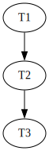

1.

$$
ids = \pi_{id\_socio} \hspace{0.1cm}(Socios)
$$
$$
califaciones\_cinco = \sigma_{estrellas\_calificacion = 5} \hspace{0.1cm} (Calificaciones)
$$
$$
peliulas\_cinco = \pi_{nombre\_pelicula, id\_socio} \hspace{0.1cm} (califaciones\_cinco)
$$
$$
respuesta = peliculas\_cinco \hspace{0.1cm} \div \hspace{0.1cm} ids
$$
$$
\pi_{nombre\_pelicula} (respuesta)
$$

2.

```
MATCH (c1:Cancion{banda:"Mac y los McMaccers", año: 2024})
WITH COUNT(DISTINCT c1) AS canciones_2024
MATCH (u1)-[:LE_GUSTA]->(c2:Cancion{banda:"Mac y los McMaccers", año: 2024})
WITH u1, COUNT(DISTINCT c2) AS canciones_que_gustan, canciones_2024
WHERE canciones_que_gustan >= 0.8 * canciones_2024
RETURN u1
```

3.

    a. Se puede pues estamos buscando por la clave de partición entera

    b. No se puede pues no estamos buscando por la clave de partición, ni siquiera es parte de la PK el apellido.

    c. No se puede pues si bien se usa la clave de partición y luego una clave de clustering, se tiene que filtrar primero por codigo de materia, respetando el orden, y como no se hace no se puede.

    d. Se puede pues se busca por clave de partición + la primera clave de clustering

    e. Se puede pues se busca por clave de partición + el conjunto de las claves de clustering

4. 

Primero que nada hago el grafo de precedencias para ver en que estado está el solapamiento antes de agregar algo.



Recordando que un solapamiento no es serializable cuando su grafo de precedencias es un DAG

a. $W_{T_{1}}(X)$. Al agregar esta escritura al final se va generar una arista de $T_{2}$ a $T_{1}$ generando un ciclo.
    
b. $R_{T_{2}}(Y)$. Al agregar esta lectura al final se va a generar una arista de $T_{3}$ a $T_{2}$ generando un ciclo.

c. Para que el solapamiento sea recuperable todas las transacciones que lean un item previamente modificado por otra transacción, deben commitear después que la transaccion "modificadora". Analizo las lecturas:

$R_{T_{1}}(X)$: nadie realizó ninguna operación previa asique no genera ningún problema.

$R_{T_{2}}(X)$: nadie modificó a $X$ antes asique tampoco genera ningún problema.

$R_{T_{3}}(X)$: $T_{2}$ modificó antes a X asique $T_{2}$ tiene que commitear antes que $T_{3}$.

$R_{T_{3}}(Y)$: nadie modificó a $Y$ antes asique tampoco genera ningún problema.

Concluyo entonces que con tal de que $T_{2}$ commitee antes que $T_{3}$ el solapamiento va ser recuperable. Propongo entonces:

$$
C_{T_{1}}, C_{T_{2}}, C_{T_{3}}
$$

5.

```
01 (BEGIN, T1);
02 (WRITE T1, A, 10);
03 (BEGIN, T2);
04 (WRITE T1, B, 20);
05 (COMMIT, T1);
06 (WRITE T2, B, 30);
07 (BEGIN CKPT, T2);
08 (BEGIN, T3);
09 (WRITE T3, C, 40);
10 (COMMIT, T3)
11 (BEGIN, T4);
12 (WRITE T4, D, 50);
```

Como es el algoritmo de UNDO, tengo que deshacer aquellas operaciones que no commitearon y abortarlas.

Commitearon: T3 (T1 tambien pero no la miro porque ya en el CKPT me daba cuenta que no estaba activa)

No commitearon: T2, T4.

Llego hasta la línea 03 que es donde inicia la transacción mas antigua del CKPT (T2)

D <- 50
B <- 30

Agrego en el log 

(ABORT, T2)

(ABORT, T4)

Flusheo todo a disco (log y valores de las "variables"). 

6.

```
SELECT * 
FROM Usuarios u 
    INNER JOIN Apuestas a ON (u.id = a.id_usuario) 
    INNER JOIN Eventos e ON (a.id_evento = a.id_evento)
WHERE e.tipo = ‘Fútbol Americano’;
```


Como no tengo indice alguno para buscar los eventos de tipo, hago un file Scan

$$
Cost(\sigma_{tipo='Fútbol Americano'}(Eventos)) = B(E) = 1000
$$

Como no hay datos sobre como se distribuyen los eventos según el tipo, estimo que se distribuyen uniformemente, por lo cual en memoria (para hacer el pipelining), voy a tener

$$
n(\sigma_{tipo='Fútbol Americano'}(Eventos)) = \frac{n(E)}{V(tipo, Eventos)} = \frac{10.000}{100} = 100
$$

Calculando la cantidad de bloques entonces:

$$
B(\sigma_{tipo='Fútbol Americano'}(Eventos)) = \lceil \frac{n(\sigma_{tipo='Fútbol Americano'}(Eventos))}{F(R)} \rceil
$$

$$
B(\sigma_{tipo='Fútbol Americano'}(Eventos)) = \lceil \frac{100}{\frac{10.000}{1.000}} \rceil = \lceil 10 \rceil = 10
$$

Calculo ahora el costo de la junta con Apuestas:

No tengo índices asique ya descarto esa posibilidad. Como tengo muchos bloques busco primero con junta por loops anidados por bloque:

$$
Cost(Eventos \bowtie Apuestas) = \lceil \frac{B(\sigma_{tipo='Fútbol Americano'}(Eventos))}{M - 2} \rceil \cdot B(Apuestas)
$$

$$
Cost(Eventos \bowtie Apuestas) = \lceil \frac{10}{1.000 - 2} \rceil \cdot 400 = 400
$$

Viendo que me queda solo el costo de $B(Apuestas)$ ya puedo estar seguro que no voy a encontrar por otro método un costo mejor que este.

Ahora calculo la cardinalidad hasta este punto, y la cantidad de bloques:

$$
n(Eventos \bowtie Apuestas) = \frac{n(Eventos) \cdot n(Apuestas)}{máx(V(id, Eventos), V(id\_evento, Apuestas))}
$$

$$
n(Eventos \bowtie Apuestas) = \frac{100 \cdot 40.000}{máx(100, 10.000)} = \frac{4.000.000}{10.000} = 400
$$

$$
F(Eventos \bowtie Apuestas) = \lceil \frac{1}{\frac{1}{F(Eventos)} + \frac{1}{F(Apuestas)}} \rceil
$$

$$
F(Eventos \bowtie Apuestas) = \lceil \frac{1}{\frac{10}{100} + \frac{400}{40.000}} \rceil = \lceil 9,09 \rceil = 10
$$

$$
B(Eventos \bowtie Apuestas) = \frac{n(Eventos \bowtie Apuestas)}{F(Eventos \bowtie Apuestas)} = \frac{400}{10} = 40
$$

Denominando $PrimeraJunta = Eventos \bowtie Apuestas$. Busco el costo de $PrimeraJunta \bowtie Usuarios$, como PrimeraJunta lo mando por pipelining no tengo el costo de sumar su bloque

$$
Costo(PrimeraJunta \bowtie Usuarios) = \lceil \frac{B(PrimeraJunta)}{M - 2} \rceil \cdot B(Usuarios)
$$

$$
Costo(PrimeraJunta \bowtie Usuarios) = \lceil \frac{40}{1.000 - 2} \rceil \cdot 50 = \lceil 50 \rceil = 50
$$

Calculo  ahora la cantidad de filas:

$$
n(PrimeraJunta \bowtie Usuarios) = \frac{n(PrimeraJunta) \cdot n(Usuarios)}{máx(V(id, Eventos), V(id, Usuarios))}
$$

$$
n(PrimeraJunta \bowtie Usuarios) = \frac{400 \cdot 2.000}{máx(400, 2.000)}
$$

En el paso previo no se si hay una forma más elegante de hacerlo pero entiendo que si tengo 400 filas del join previo como MUCHO mi variabilidad va ser de 400, no hay forma de que sea más. Desconozco si se puede estimar de otra forma.

$$
n(PrimeraJunta \bowtie Usuarios) = \frac{400 \cdot 2.000}{2.000} = 400
$$

Entonces como respuesta final tengo que la cardinalidad es:

$$
n(Eventos \bowtie Apuestas \bowtie Usuarios) = 400
$$

Y mi costo

$$
Cost(Eventos \bowtie Apuestas \bowtie Usuarios) = Cost(FileScan(Eventos)) + Cost(Eventos \bowtie Apuestas) + Cost((Eventos \bowtie Apuestas) \bowtie Usuarios) 
$$

$$
Cost(Eventos \bowtie Apuestas \bowtie Usuarios) = 1.000 + 400 + 50 = 1.450
$$