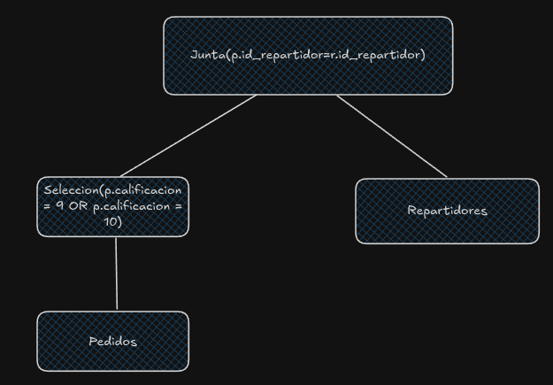
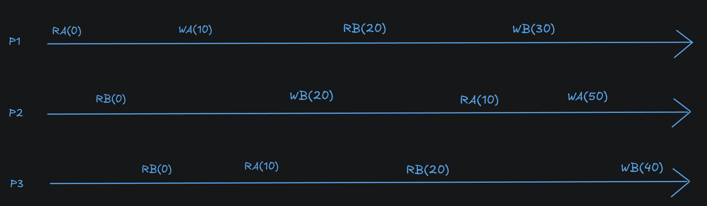

1.

Opción I:

```
SELECT g.ganador
FROM Ganadores g
WHERE g.nombre_torneo = 'Champions Liga'

EXCEPT

SELECT g.ganador
FROM Ganadores g
WHERE g.nombre_torneo = 'Ke Torneo' OR g.nombre_torneo = 'Torneo en Bloque'
```

Opción II:

```
SELECT g.ganador
FROM Ganadores g
WHERE g.nombre_torneo = 'Champions Liga' 
    AND g.ganador NOT IN (
        SELECT g2.ganador
        FROM Ganadores g2
        WHERE g2.nombre_torneo = 'Ke Torneo' OR g2.nombre_torneo = 'Torneo en Bloque'
    )
```

2.

```
MATCH (p1:Persona{DNI: 12345678}),
    (AbuelxP1:Persona)<-[:HIJO_DE]-(XadreP1:Persona)<-[:HIJO_DE]-(p1),
    (AbuelxP1)<-[:HIJO_DE]-(Tix:Persona)<-[:HIJO_DE]-(primx:Persona)
WHERE XadreP1.DNI <> Tix.DNI
RETURN primx
```

3.



Primero hago la selección para aprovechar pipelining después, como no hay índices, tengo que hacer un FileScan:

$$
Cost(\sigma_{calificacion=9 \hspace{0.1cm} OR \hspace{0.1cm} calificacion=10}(Pedidos)) = B(Pedidos) = 100.000
$$

Calculo las filas que salen de aca:

$$
n(\sigma_{calificacion=9 \hspace{0.1cm} OR \hspace{0.1cm} califacion=10}(Pedidos))= 100.000 \cdot \frac{2}{8} = 25.000
$$

Estimacion cantidad de bloques de la selección

$$
B(\sigma_{calificacion=9 \hspace{0.1cm} OR \hspace{0.1cm} califacion=10}(Pedidos)) = \lceil \frac{n(\sigma_{calificacion=9 \hspace{0.1cm} OR \hspace{0.1cm} califacion=10})}{F(R)} \rceil
$$

$$
B(\sigma_{calificacion=9 \hspace{0.1cm} OR \hspace{0.1cm} califacion=10}(Pedidos)) = \lceil \frac{25.000}{\frac{1.000.000}{100.000}} \rceil = \lceil 2.500 \rceil = 2.500
$$

Calculo el costo de la junta ahora:

$$
Cost(Pedidos_{\sigma} \bowtie Repartidores) = \lceil \frac{B_{\sigma}}{M-2} \rceil \cdot B(Repartidores)
$$

$$
Cost(Pedidos_{\sigma} \bowtie Repartidores) = \lceil \frac{2.500}{98} \rceil \cdot 2.000 = \lceil 25,51 \rceil \cdot 2.000 = 52.000
$$

Tengo como costo total:

$$
Cost(Pedidos \bowtie Repartidores) = Cost(FileScan(Pedidos)) + Cost (Pedidos_{\sigma} \bowtie Repartidores) = 100.000 + 52.000 = 152.000
$$

4.

```
01 (BEGIN, T1); 
02 (WRITE T1, A, 1, __ ); 
03 (BEGIN CKPT, ___ ); 
04 (COMMIT, T1); 
05 (BEGIN, T2); 
06 (WRITE T2, A, 2, 4); 
07 (COMMIT, T2); 
08 (END CKPT); 
09 (BEGIN, T3); 
10 (BEGIN CKPT, ___ ); 
11 (WRITE T3, A, ___ , 3); 
12 (WRITE T3, B, 6, 7);
```

Completando los valores:

```
01 (BEGIN, T1); 
02 (WRITE T1, A, 1, 2); 
03 (BEGIN CKPT, T1); 
04 (COMMIT, T1); 
05 (BEGIN, T2); 
06 (WRITE T2, A, 2, 4); 
07 (COMMIT, T2); 
08 (END CKPT); 
09 (BEGIN, T3); 
10 (BEGIN CKPT, T3); 
11 (WRITE T3, A, 4, 3); 
12 (WRITE T3, B, 6, 7);
```

Primero busco transacciones commiteadas y no commiteadas:

Commiteadas: $T_1$, $T_2$

No commiteadas: $T_3$

Hago UNDO de las transacciones no commiteadas:

B <- 6

A <- 4

Ahora hago REDO de las transacciones commiteadas de la transacción más vieja del BEGIN CKPT inicial

A <- 2

A <- 4

Escribo al final del LOG

(ABORT, T3)

Y flusheo todo a disco

6.



Concluyo entonces que esta ejecución tiene consistencia secuencial.