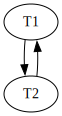

1.

```
SELECT e.apellido
FROM Estudiantes e
GROUP BY e.apellido
HAVING COUNT(DISTINCT e.provincia_nacimiento) = (
    SELECT COUNT(DISTINCT provincia_nacimiento)
    FROM Estudiantes
)
```

2.

Opción I:

```
db.notas.aggregate([
    // separo segun notas de parcial
    {
        $unwind: "$notas_parcial"
    },
    // si una persona no aprobó la materia, simplemente no voy a encontrar ningun registro que sea con su nombre y que sea mayor igual a 4. A su vez, asumo que una vez aprobado un parcial, esa es la nota definitoria, no existe la posibilidad de levantar la nota
    {
        $match: {
            "notas_parcial.nota": {$gte: 4}
        }
    },
    {
        $group: {
            _id: "$notas_parcial.nota",
            cantidad_alumnos: {$sum: 1}
        }
    },
    {
        $project: {
            _id: 0,
            nota: "$_id",
            cantidad_alumnos: 1
        }
    }
])
```

Opción II: (me quedo con la mayor de sus notas de aprobación)

```
db.notas.aggregate([
    // separo segun notas de parcial
    {
        $unwind: "$notas_parcial"
    },
    // si una persona no aprobó la materia, simplemente no voy a encontrar ningun registro que sea con su nombre y que sea mayor igual a 4. A su vez, asumo que una vez aprobado un parcial, esa es la nota definitoria, no existe la posibilidad de levantar la nota
    {
        $match: {
            "notas_parcial.nota": {$gte: 4}
        }
    },
    {
        $group: {
            _id: "$padron",
            mejor_nota: {$max: "$notas_parcial.nota"}
        }
    },
    {
        $group: {
            _id: "$mejor_nota",
            cantidad_alumnos: {$sum: 1}
        }
    },
    {
        $project: {
            _id: 0,
            nota: "$_id",
            cantidad_alumnos: 1
        }
    }
])
```

3.

Plato: nombre, tipo
Restaurante: nombre, direccion
Ingrediente: nombre, tieneGluten

(p)-[:SE_VENDE_EN {precio}]->(r)

(p)-[:USA]->(i1)

```
MATCH(principal:Plato{tipo:"Principal"})-[sv1:SE_VENDE_EN]->(r1:Restaurante),
    (postre:Plato{tipo:"Postre"})-[sv2:SE_VENDE_EN]-(r1)
WHERE NOT EXISTS {
    (principal)-[u:USA]->(:Ingrediente{tieneGluten:true})
} AND NOT EXISTS {
    (postre)-[:USA]->(:Ingrediente{tieneGluten:true})
}
WITH principal, postre, r1, sv1.precio + sv2.precio AS precio_menu
WHERE precio_menu < 9000
RETURN principal, postre, r1, precio_menu
```

4.

```
01 (BEGIN, T1); 
02 (WRITE T1, A, 1); 
03 (BEGIN, T2); 
04 (WRITE T2, B, 2); 
05 (COMMIT, T1); 
06 (BEGIN CKPT, T2); 
07 (WRITE T2, A, 3); 
08 (COMMIT, T2); 
09 (END CKPT); 
10 (BEGIN, T3); 
11 (WRITE T3, B, 4);
```

Arrancan con 0 A y B.

Como tengo el ENDCKPT estoy seguro que lo que está del begin ckpt q está commiteado está en disco. por lo cual si o si tengo:

A: 1

Después respecto a B tengo tres posibles como T2 commiteada pero dsp del BEGIN CKPT, tengo tres posibles valores:

$B = 0$ o $B = 2$

B=4 no es posible porque T3 no commiteo

Respecto a A o tiene el valor 1 o tiene el valor 3 por las mismas razones, porque T2 commiteó pero eso no implica que esté salvado en disco

5.

$$
b_{T_{1}}; b_{T_{2}}; W_{T_{1}}(X); W_{T_{2}}(Y);\_\_; R_{T_{1}}(Y); C_{T_{2}}; C_{T_{1}}
$$

Para que un solapamiento no sea recuperable si una transacción lee un item que otra transacción modificó antes, y además, la que lee commitea **antes** que la transacción que modifica. 

Teniendo en cuenta esto, y que $T_2$ commitea antes que $T_1$ propongo agregar $R_{T_2}(X)$

$$
b_{T_{1}}; b_{T_{2}}; W_{T_{1}}(X); W_{T_{2}}(Y);R_{T_{2}}(X); R_{T_{1}}(Y); C_{T_{2}}; C_{T_{1}}
$$

Analizando ahora la serializibilidad armo el grafo de precedencias:



Como se forma un ciclo, quedando un grafo que no es un DAG, el solapamiento **no es serializable**. 

6.

Primero que nada realizo la selección para aprovechar el pipelining

Como no poseo indices voy a tener que cargar todos los bloques de la tabla compositores para hacer un FileScan

$$
Cost(\sigma_{año\_fallecimiento <= 1800}(Compositores)) = B(Compositores)
$$

Según los datos del enunciado ya se que solo el 10% de la meustra falleció **antes** de 1800.

$$
n(\sigma_{año\_fallecimiento <= 1800}(Compositores)) = 0,1 \cdot n(Compositores) = 0,1 \cdot 100.000 = 10.000
$$

Calculo los bloques ahora:

Primero calculo el $F(Compositores)$:

$$
F(Compositores) = \frac{n(Compositores)}{B(Compositores)} = \frac{100.000}{20.000} = 5
$$

$$
B(\sigma_{año\_fallecimiento <= 1800}(Compositores)) = \lceil \frac{n(\sigma_{año\_fallecimiento <= 1800}(Compositores))}{F(Compositores)} \rceil = \lceil \frac{10.000}{5} \rceil = \lceil 2.000 \rceil = 2.000
$$

Por la variabilidad, y mismo por el nombre de los campos, me doy cuenta que id_compositor es PK de la tabla Compositores, por lo cual me va quedar una variabilidad de $10.000$ luego de la selección.

Ahora sí realizo la junta, pruebo con loops anidados ya que tengo bastantes bloques de memoria.

$$
Cost(Compositores_{\sigma} \bowtie Obras) = \lceil \frac{B(Compositores_{\sigma})}{M-2} \rceil \cdot B(Obras)
$$

$$
Cost(Compositores_{\sigma} \bowtie Obras) = \lceil \frac{2.000}{2.003} \rceil \cdot 500.000 = 500.000
$$

Viendo que el costo de la junta es de solo $B(Obras)$ (no sumo los bloques iniciales de compositores pues usé pipelining) $\rightarrow$ este es el mejor método, quedandome como costo final

$$
Cost(Compositores \bowtie Obras) = Cost(\sigma_{año\_fallecimiento<=1800}(Compositores)) + Cost(Compositores_{\sigma} \bowtie Obras)
$$

$$
Cost(Compositores \bowtie Obras) = 20.000 + 500.000 = 520.000
$$
