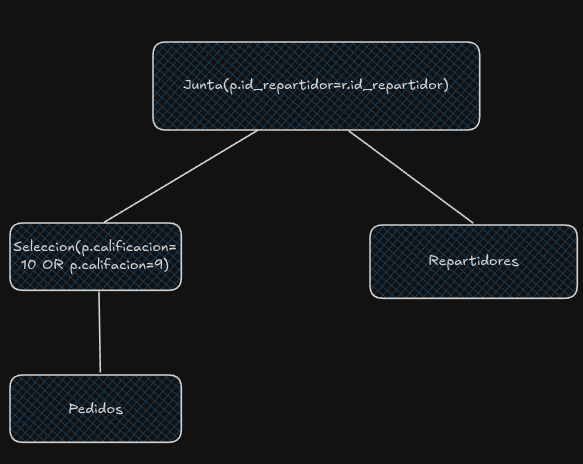

1.

Escriba una consulta que devuelva el nombre de las instituciones con alto grado de inmadurez. Esto se determina cuando hay mas de 20 personas pertenecientes a la institucion para los que mas del 50% de sus interes están registrados como inmaduros.

```
MATCH(p:Persona)-[:PERTENECE_A]->(i:Institucion),
    (p)-[:INTERESADO_EN]->(interes:Interes)
WITH p, i, COUNT(DISTINCT interes) AS total_intereses, COUNT(CASE WHEN interes.inmaduro THEN 1 END) AS intereses_inmaduros
WHERE intereses_inmaduros > 0.5 * total_intereses
WITH p, i, COUNT(DISTINCT p.id) AS cantidad_personas
WHERE cantidad_personas > 20
RETURN i.nombre
```

2.

Devuelva los ids de usuarios que en 2025 visitaron las mismas ciudades que Johann Sebastian visitó en el mismo año. EL id del celular de Johann Sebastian es 12345. Los stalkers pueden haber visitado otras ciudades además que las de Johann

// asumo que puedo hacer fecha.año si no tendria que comparar con horas y demás que me da un toque de paja sinceramente.

$$
visitas\_2025 = \sigma_{fecha.año=2025} (Ubicacion)
$$
$$
ciudades\_johan = \pi_{id\_ciudad}(\sigma_{id_celular=12345} (visitas\_2025))
$$
$$
ubicaciones\_no\_johan = \sigma_{id\_celular<>12345} (visitas\_2025)
$$
$$
otras_personas = \pi_{id\_celular}(ubicaciones\_no\_johan \bowtie_{ubicaciones\_no\_johan.id\_ciudad=ciudades\_johan.id\_ciudad} ciudades\_johan)
$$
$$
otras\_personas\_real = \pi_{id\_celular}(otras\_personas \div ciudades\_johan)
$$

3.

Genere una consulta que devuelva los 5 paises con la mayor cantidad de juegos en los que un usuario del pais consiguio al menos un logro

```
db.logros.aggregate([
    {
        $unwind: "$usuarios"
    },
    {
        $group: {
            _id: {
                pais: "$usuarios.pais",
                juego: "$juego"
            }
        }
    }, 
    {
        $group: {
            _id: "$_id.pais"
        },
        cantidad_juegos_con_logro: {$sum: 1}
    },
    {
        $sort: {
            juegos_con_logro: -1
        }
    }, 
    {
        $limit: 5
    }
])
```

4.

```
01 (BEGIN, T1)
02 (WRITE T1, A, 0, 1)
03 (BEGIN, T2)
04 (WRITE T1, B, 0, 2) 
05 (BEGIN CKPT, T1, T2)
06 (COMMIT, T1)
07 (WRITE T2, A, 1, 3)
08 (WRITE T2, C, 0, 4)
09 (BEGIN, T3)
10 (COMMIT, T2)
11 (WRITE T3, B, 2, 5)
```

Como no hay un end ckpt, tengo que ir hasta el inicio del log. Inicialmente tienen todos 0.

En disco entonces puedo tener:

```
A: 0; 1; 3.
B: 0; 2, 5.
C: 0; 4.
```

5.

Transaccion con $TS=40$ intenta acceder a un item X. Indice para cada una de las siguientes situaciones si puede leer o no el item y si puede escribir o no el item.

    a.

    Lectura: puede (WRITE_TS(X) <= TS)

    Escritura: puede (WRITE_TS(X) <= TS AND READ_TS(X) <= TS)

    b.

    Lectura: puede (WRITE_TS(X) <= TS)

    Escritura: no puede (READ_TS(X) > TS)

    c.

    Lectura: no puede (WRITE_TS(X) > TS)

    Escritura: no puede (WRITE_TS(X) > TS)

    d.

    Lectura: no puede (WRITE_TS(X) > TS)

    Escritura: no puede (WRITE_TS(X) > TS, ya con esto no puede pero ademas READ_TS(X) > TS asique tampoco podría por esto)

6.

```
SELECT *
FROM repartidores r
    INNER JOIN pedidos p USING (id_repartidor)
WHERE p.calificacion = 10 OR p.calificacion = 9
```



Realizo primero la selección para aprovechar el pipelining. Como no hay indices, voy a tener que hacer un FileScan
$$
Cost(\sigma_{calificacion=10 \lor calificacion=9}(Pedidos)) = Cost(FileScan(Pedidos)) = B(Pedidos) = 1.000.000
$$
$$
n(\sigma_{calificacion=10 \lor calificacion=9}(Pedidos)) = \frac{n(Pedidos)}{V(calificacion, Pedidos)} + \frac{n(Pedidos)}{V(calificacion, Pedidos)}
$$
$$
n(\sigma_{calificacion=10 \lor calificacion=9}(Pedidos)) = \frac{2}{V(calificacion, Pedidos)} \cdot n(Pedidos) = \frac{2}{5} \cdot 10.000.000 = 4.000.000
$$

Estimo cantidad de bloques

$$
F(Pedidos) = \frac{n(Pedidos)}{B(pedidos)} = \frac{10.000.000}{1.000.000} = 10
$$
$$
B(\sigma_{calificacion=10 \lor calificacion=9}(Pedidos)) = \lceil \frac{n(\sigma_{califacion=10 \lor calificacion=9}(Pedidos))}{F(Pedidos)} \rceil
$$
$$
B(\sigma_{calificacion=10 \lor calificacion=9}(Pedidos)) = \lceil \frac{4.000.000}{10} \rceil = \lceil 400.000 \rceil = 400.000
$$

Tengo $M=200$ y me piden loops anidados por bloque, asique utilizo la formula del método

$$
Cost(Pedidos_{\sigma} \bowtie Repartidores) = \lceil \frac{B(Pedidos_{\sigma})}{M-2} \rceil \cdot B(Repartidores)
$$
$$
Cost(Pedidos_{\sigma} \bowtie Repartidores) = \lceil \frac{400.000}{198} \rceil \cdot 5.000 = \lceil 2.020,2 \rceil \cdot 5.000 = 2.021 \cdot 5.000 = 10.105.000
$$

Entonces el costo total de la consulta es 

$$
Cost(consulta) = Cost(\sigma_{calificacion=10 \lor calificacion=9}(Pedidos)) + Cost(Pedidos_{\sigma} \bowtie Repartidores) 
$$
$$
Cost(consulta) = 1.000.000 + 10.105.000 = 11.105.000
$$
