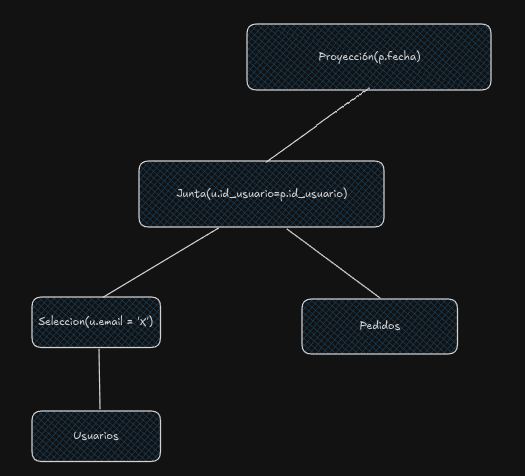
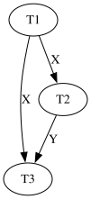

1.

Clientes(id_cliente, nombre, email, pais, fecha_creacion, ...)

```
SELECT * FROM Clientes WHERE pais = 'Argentina' OR pais = 'Uzbekistan';
```

a.

$$
F(Clientes) = \frac{n(Clientes)}{B(Clientes)} = \frac{1.200.000}{400.000} = 3
$$

Indice de clustering de altura 2 en columna pais.

$$
Cost(\sigma_{pais='Argentina' \lor pais='Uzbekistan'}) = Height(I(Pais, Clientes)) + \lceil \frac{n(Clientes)}{V(Pais, Clientes) \cdot F(Clientes)} \rceil
$$

Separo en dos casos, primero busco para Argentina:

$$
Cost(\sigma_{pais='Argentina'}) = 2 + \lceil \frac{200.000}{3} \rceil = 2 + \lceil 66.666,66 \rceil
$$

$$
Cost(\sigma_{pais='Argentina'}) = 2 + 66.667 = 66.669
$$

Busco para Uzbekistan:

$$
Cost(\sigma_{pais='Uzbekistan'}) = Height(I(Pais, Clientes)) + \lceil \frac{n(Clientes)}{V(Pais, Clientes) \cdot F(Clientes)} \rceil = 2 + \lceil \frac{1.200.000-250.000-200.000-150.000}{80 \cdot 3} \rceil
$$
$$
Cost(\sigma_{pais='Uzbekistan'}) = 2 + \lceil \frac{600.000}{240} \rceil = 2 + 2.500 = 2.502
$$
$$
Cost(Total) = 66.669 + 2.502 = 69.171
$$

Un File Scan costaria $B(Clientes) = 400.000$ por lo cual conviene utilizar el índice.

b.

$$
n(\sigma_{pais='Uzbekistan'}(Clientes)) = \frac{600.000}{80} = 7.500
$$
$$
n(\sigma_{pais='Argentina' \lor pais='Uzbekistan'}) = n(\sigma_{pais='Argentina'}(Clientes)) + n(\sigma_{pais='Uzbekistan'}(Clientes)) = 200.000 + 7.500 = 207.500
$$

2.

- Usuarios(id_usuario, email, direccion, ultimo_login)
- Pedidos(id_pedido, id_usuario, fecha, tipo)

```
SELECT 
    fecha
FROM 
    Usuarios u, Pedidos p
WHERE 
    p.id_usuario = u.id_usuario AND
    u.email = 'immcnabb@nfl.com' AND
    p.tipo = 'Urgente'
```

Indice Usuarios: id_usuario (I1), email (I2).

Indice Pedidos: id_usuario (I3), tipo (I4).

Todos son índices secundarios.



Lo hago de esta forma pues al ser $V(email, Usuarios) = n(Usuarios)$ me va quedar 1 sola fila ahi, por lo cual siguiendo la heuristica, realizó las operaciones más restrictivas primero y después aprovecho pipelining. La selecccion de Pedidos se va hacer en la propia junta con lo que ya tengo en memoria.

b.

$$
Cost(\sigma_{email='X'}(Usuario)) = Height(I(email, Usuarios)) + \lceil \frac{n(Clientes)}{V(email, Clientes)} \rceil = 4 + 1 = 5
$$

Para la junta pruebo con loop con unico indice

$$
Cost(Usuarios_{\sigma} \bowtie Pedidos) = n(Usuarios_{\sigma}) \cdot \lceil Height(I(id_usuario, Pedidos)) + \lceil \frac{n(Pedidos)}{V(id_usuario, Pedidos)} \rceil \rceil
$$
$$
Cost(Usuarios_{\sigma} \bowtie Pedidos) = 1 \cdot \lceil 4 + \lceil \frac{320.000}{80.000} \rceil \rceil = 8
$$

Luego como ya dije la seleccion de Pedidos se evalua en memoria cuando se hace la junta, y la proyección como no tiene un DISTINCT tiene un coste 0.

$$
Cost(Consulta) = Cost(\sigma_{email='X'}(Usuario)) + Cost(Usuarios_{\sigma} \bowtie Pedidos) = 5 + 8 = 13
$$

3.

a.

```
db.papers.aggregate([
    {
        $unwind: "$autores"
    },
    {
        $match: {
            categoria: "Informática"
        }
    }, 
    {
        $group: {
            _id: "$autores",
            cantidad: {$sum: 1},
            promedio_puntaje: {$avg: "$puntaje"}
        }
    },
    {
        $match: {
            cantidad: {
                $gte: 10
            }
        }
    },
    {
        $project: {
            _id: 0,
            autor: "$_id.autores",
            cantidad: 1,
            promedio_puntaje: 1
        }
    }
])
```

b. Para que sea lo más distribuido posible deberia shardearse por id ya que tiene una alta cardinalidad.

No usaria como shard key la categoria ya que no lo hace distribuida, ya que como estoy buscando por categoría estaría buscando todo en un único nodo.

4.

```
MATCH (u1:Usuario)-[p1:PUNTUA]->(pub:Publicacion),
    (u2:Usuario)-[p2:PUNTUA]->(pub:Publicacion)
WHERE u1.username > u2.username AND
    p1.puntaje >= 8 AND
    p2.puntaje >= 8
WITH u1, u2, COUNT(pub) AS cantidad_publicaciones
WHERE cantidad_publicaciones >= 5
WITH u1, u2
WHERE NOT EXISTS {
    MATCH (u1)-[p3:PUNTUA]->(pub3:Publicacion),
        (u2)-[p4:PUNTUA]->(pub4:Publicacion)
    WHERE pub3.id = pub4.id AND (
        (p3.puntaje >= 8 AND p4.puntaje <= 7)
        OR
        (p4.puntaje >= 8 AND p3.puntaje <= 7)
    )
}
RETURN u1, u2
```

5.

$$
b_{T_1};b_{T_2};b_{T_3};W_{T_1}(X);R_{T_3}(X);R_{T_2}(Y);R_{T_2}(Z);R_{T_1}(Z);c_{T_1};R_{T_2}(X);W_{T_3}(Y);c_{T_2};c_{T_3}
$$

a. 



b. El solapamiento es serializable porque el grafo de precedencias es un DAG. Una ejecución posible es $T_1;T_2;T_3$

c. Para que el solapamiento sea recuperable aquellas transacciones que lean un dato modificado previamente por otra transacción, deben commitear despues que la transacción "modificadora". Por lo cual miro las lecturas.

- $R_{T_3}(X)$: $T_1$ escribe X antes, pero commitea antes esto no rompe nada, por ahora es recuperable.
- $R_{T_2}(Y)$: nadie modificó a $Y$ antes, no genera problemas.
- $R_{T_2}(Z)$: idem el item anterior.
- $R_{T_1}(Z)$: idem el item anterior.
- $R_{T_2}(X)$: $T_1$ escribe X antes, pero como $T_1$ commitea antes que $T_2$, por ahora sigue siendo recuperable.

Analizadas todas las lecturas, concluyo que el solapamiento es recuperable.

6.

```
01 (BEGIN, T1)
02 (WRITE, T1, A, 10)
03 (BEGIN, T2)
04 (WRITE, T2, D, 20)
05 (BEGIN, T3)
06 (COMMIT, T2)
07 (BEGIN CKPT, T1, T3)
08 (WRITE, T3, B, 40)
09 (BEGIN, T4)
10 (COMMIT, T3)
11 (WRITE, T4, C, 17)
12 (END CKPT)
13 (COMMIT, T1)
14 (BEGIN CKPT, T4)
15 (WRITE, T4, B, 30)
16 (COMMIT, T4)
```

Es REDO por lo cual tengo que rehacer las transacciones que ya commitearon. Veo en BEGIN CKPT, T4 pero no su END, por lo cual busco el sigueinte BEGIN CKPT. Estoy seguro que arriba del BEGIN CKPT de la linea 07 está flusheado a disco, lo de abajo no.

Commitearon sin flush (T1, T3, T4)

Voy hasta la linea 01. (el begin de la transaccion mas vieja que)

```
A <- 10
B <- 40
C <- 17
B <- 30
```

Como todas commitearon no agrego nada al log.

Flusheo todo a disco.
