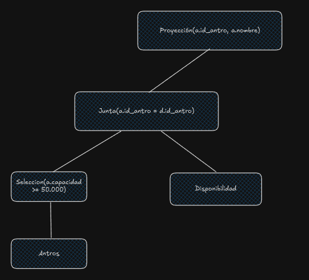
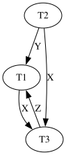

1.

```
SELECT 
    a.id_antro, nombre
FROM 
    antros a
        INNER JOIN disponibilidad d USING(id_antro)
WHERE
    (a.provincia = 'Catamarca' OR a.provincia = 'La Rioja') AND
    a.capacidad >= 50.000 AND
    (d.fecha BETWEEN '2025-01-06' AND '2025-01-10')
```

Para calcular el costo de esta consulta voy a ver por donde me conviene arrancar. Tengo dos opciones para aprovechar pipelining, hacer la seleccion por capacidad o la seleccion segun la fecha. Voy a priorizar aquella selección que de como resultado menos rows.

El enunciado me dice que solo el 10% de los antros tiene capacidad para al menos 50.000 personas, por lo cual miro:

$$
n(\sigma_{capacidad \geq 50.000 \wedge (provincia='x' \lor provincia='y')}(Antros)) = \frac{0,1 \cdot 2 \cdot 10.000}{20} = \frac{2.000}{20} = 100
$$

Ya a ojo estoy casi seguro que conviene esta selección primero, pero hago la cuenta si hiciera la selección primero del between

$$
n(\sigma_{'2025-01-06' \leq fecha \leq '2025-01-10'}(Disponibilidad)) = \lceil \frac{5}{100} \cdot \frac{100.000}{10.000} \rceil = 0,5
$$



Empiezo ahora sí a calcular el costo.

Uso el indice de provincia y dsp el chequeo de la capacidad de la capacidad lo hago en memoria

$$
Cost(\sigma_{provincia='x' \lor provincia='y'}(Antros)) = Height(I(Provincia, Antros)) + \lceil \frac{n(Antros)}{V(Provincia, Antros)} \rceil
$$

$$
Cost(\sigma_{provincia='x' \lor provincia='y'}(Antros)) = 2 \cdot [2 + \lceil \frac{10.000}{20} \rceil] = 2 \cdot 502 = 1.004
$$

Calculo el costo de la junta. Pruebo con loop con único índice. Ya tengo en memoria (usando pipelining) a los bloques de Antros por lo cual esa parte del costo de la junta será 0

$$
Cost(Antros \bowtie Disponibilidad) = n(Antros_{\sigma}) \cdot [Height(I(id\_antro, Disponibilidad)) + \lceil \frac{n(Disponibilidad)}{V(id\_antro, Disponiblidad)} \rceil ]
$$

$$
Cost(Antros \bowtie Disponibilidad) = 100 \cdot [4 + \lceil \frac{100.000}{10.000} \rceil] = 1.400
$$

Luego la seleccion de la fecha también se hace en memoria, y como la proyección no tiene DISTINCT el costo es 0 dejando un coste final de 

$$
Cost(Consulta) = Cost(\sigma_{provincia='x' \lor provincia='y'}(Antros)) + Cost(Antros \bowtie Disponibilidad) = 1.004 + 1.400 = 2.404
$$

Como estime 50 filas para la seleccion completa de Antros y 5.000 para la de Disponibilidad las filas finales serán

$$
n(Consulta) = 100 \cdot \frac{5}{100} \cdot 10 = 50
$$

2.

- GenerosFavoritos(id_usuario, id_genero)
- Juegos(id_juego, nombre, id_genero)

Usando Hash Grace

$$
Cost(GenerosFavoritos \bowtie Juegos) = 3 \cdot (B(GenerosFavoritos) + B(Juegos)) = 3 \cdot 6.000 = 18.000
$$

Calculo ahora la cantidad minima de memoria

En Hash Grace se debe cumplir:

$$
P \leq M - 1
$$
y
$$
min(\lceil\frac{B(GenerosFavoritos)}{P}\rceil;\lceil\frac{B(Juegos)}{P}\rceil) \leq M - 2
$$

Reemplazando e igualando para hacer el "peor caso":

$$
\frac{1.000}{M-1} = M-2 \rightarrow 1000 = (M-2)\cdot(M-1)
$$
$$
1000 = M²-3M+2 \rightarrow M²-3M-998=0
$$

Usando Bhaskara obtengo:

$$
M1=33,12; M2=-30,12
$$

Tengo que usar un valor real positivo y redondeando para arriba obtengo entonces que necesito $M=34$

3.

```
MATCH(c1:Clase{tipo:"Presencial"})
WITH COUNT(c1) AS cantidad_clases_presenciales

MATCH(a1:Alumno)-[asistencias:ASISTIO{tipo:"Presencial"}]-(c2:Clase{tipo:"Presencial"})
WITH a1, cantidad_clases_presenciales, COUNT(c2) AS asistencias_alumno

WHERE a1.nota < 4 AND
    cantidad_clases_presenciales = asistencias_alumno
RETURN a1.padron, a1.nombre
```

4.

```
db.premios.aggregate([
    {
        $match: {
            año: {$gte: 2010}
        }
    },
    {
        $unwind: "$ganadores"
    },
    {
        $group: {
            _id: {
                plato: "$ganadores.plato",
                año: "$año"
            }
        }
    }, 
    {
        $group: {
            _id: {
                plato: "$_id.plato"
            }
            cantidad_años: {$sum: 1}
        }
    }, 
    {
        $match: {
            cantidad_años: {$gte: 3}
        }
    },
    {
        $project: {
            _id: 0,
            nombre_plato: "$_id.plato",
            años_ganando: "$cantidad_años"
        }
    }
])
```

5.

$$
b_{T_1};R_{T_1}(X);b_{T_2};R_{T_2}(X);W_{T_2}(Y);b_{T_3};W_{T_3}(Z);R_{T_1}(Z);W_{T_3}(X);R_{T_1}(Y)
$$

a. 



Como el grafo no es un DAG, el solapamiento no es serializable.

b. Para que el solapamiento sea serializable las transacciones que lean un item modificado previamente por otra transacción, deben commitear después que la transacción "modificadora". Miro las lecturas que pueden generar problemas (ignoro las primeras que no hay ninguna escritura previa):

- $T_1$ debe commitear despues que $T_3$ por el par $W_{T_3}(Z);R_{T_1}(Z)$
- $T_1$ debe commitear despues que $T_2$ por el par $W_{T_2}(Y);R_{T_1}(Y)$

Propongo entonces como posible solución $c_{T_2};c_{T_3};c_{T_1}$

c. El solapamiento con los commits agregado permite el rollback en cascada pues para evitarlos los commits deberían estar previo a las lecturas "conflictivas", y como se pide agregarlas todas al final, no hay forma de evitar esta permisión.

6.

```
01 (BEGIN, T1)
02 (WRITE T1, A, 10)
03 (BEGIN, T2)
04 (WRITE T1, B, 20)
05 (COMMIT, T1)
06 (WRITE T2, B, 30)
07 (BEGIN CKPT, T2)
08 (BEGIN, T3)
09 (WRITE T3, C, 40)
10 (COMMIT, T2)
11 (BEGIN, T4)
12 (WRITE T4, D, 50)
13 (END, CKPT)
14 (COMMIT, T4)
```

Tengo que rehacer las transacciones commiteadas (T2, T4). Veo un CKPT con su END donde solo tengo T2. Busco entonces el inicio de T2

Llego a la linea 03 y arranco a rehacer

```
B <- 30
D <- 50
```

Agrego el correspondiente $(ABORT, T3)$ pues no commiteó. Flusheo todo a disco!