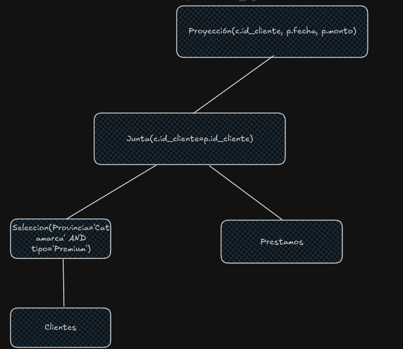
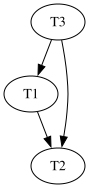

1.

Tengo dos opciones: o realizar la seleccion de clientes primero, usar pipelining, juntar y luego hacer la selección de prestamos; o realizar la seleccion de prestamos primero usar pipelining y juntar y luego hacer la selección de clientes.

Estimo entonces cuantas bloques me va dejar cada selección de hacerla primero. Asumo distro uniforme de aquellas variables que no tengo datos.

$$
F(Clientes) = \frac{n(Clientes)}{B(Clientes)} = \frac{100.000}{20.000} = 5
$$

$$
n(\sigma_{provincia='Catamarca' \wedge tipo='Premium'}(Clientes)) = \lceil \frac{n(Clientes)}{V(provincia, Clientes) \cdot V(tipo, Clientes)} \rceil = \lceil \frac{100.000}{20 \cdot 4} \rceil = 1.250
$$

$$
B(\sigma_{provincia='Catamarca' \wedge tipo='Premium'}(Clientes)) = \lceil \frac{n_{\sigma}(Clientes)}{F(Clientes)} \rceil = \lceil \frac{1.250}{5} \rceil = 250
$$



La selección de la fecha la hago en la propia junta en memoria, no genera un costo extra.

Calculo el costo de la primera selección. No son de clustering, hago una busqueda por el indice que me da menor costo y la otra restricción la chequeo en memoria. Si bien la altura de provincia es mayor, tiene mayor variabilidad asique uso ese:

$$
Cost(\sigma_{provincia='Catamarca' \wedge tipo='Premium'}(Clientes)) = Height(I(Provincia, Clientes)) + \lceil \frac{n(Clientes)}{V(Provincia, Clientes)} \rceil
$$
$$
Cost(\sigma_{provincia='Catamarca' \wedge tipo='Premium'}(Clientes)) = 2 + \lceil \frac{100.000}{20} \rceil = 2 + 5.000 = 5.002
$$

Ahora busco el costo de la junta, como ya tengo cargado la tabla de clientes (uso pipelining), no sumo el coste inicial. Pruebo con junta por loop con único índice usando el indice de Préstamos:

$$
Cost(Clientes_{\sigma} \bowtie Prestamos) = n(Clientes_{\sigma}) \cdot \lceil Height(I(id\_cliente, Prestamos)) + \lceil \frac{n(Prestamos)}{V(id\_cliente, Prestamos)} \rceil \rceil 
$$
$$
Cost(Clientes_{\sigma} \bowtie Prestamos) = 1.250 \cdot \lceil 3 + \lceil \frac{100.000}{10.000} \rceil \rceil = 1250 \cdot 13 = 16.250
$$

Veo que es la mejor opcion de junta porque en el caso de loops anidados por bloque tendría 3 veces los bloques de Prestamos (Cost=30.000). Hash Grace tendría $3 \cdot [B(Clientes)+B(Prestamos)]$ lo cual claramente es peor, y en el caso de Sort Merge por lo menos tendría $B(Clientes) + B(Prestamos)$ lo cual ya es peor que lo calculado.

Concluyo entonces que el costo total de la consulta es:

$$
Cost(Consulta) = 5.002 + 16.250 = 21.252
$$

La proyección y el resto de restricciones que se imponen en las selecciones se hace aprovechando pipelining/que ya tenemos cosas en memoria. 

Estimo ahora sí la cantida de filas resultantes de la consulta. Ya se que de la primera selección obtengo $1.250$ filas y también que de prestamos tengo $0,05 \cdot 100.000 = 5.000$ filas.

$$
n(Clientes \bowtie Prestamos) = \frac{n_{\sigma}(Clientes) \cdot n_{\_sigma}(Prestamos)}{max(V(id\_cliente, Clientes), V(id\_cliente, Prestamos))} = \frac{6.250.000}{10.000} = 625
$$

$$
n(Clientes \bowtie Prestamos) = \frac{1.250 \cdot 5.000}{max(1.250, 10.000)} = \frac{6.250.000}{10.000} = 625
$$

2.

Fulki se que tengo $70.000 \cdot 0,05$ (chances de que ponga un 10) $\rightarrow 3500$

Estimo la cantidad que va tener D.J. Ann

$$
n(\sigma_{p.usuario = 'D.J. Ann'}(Puntuaciones)) = 1.000.000 - 100.000 - 70.000 - 50.000 = 780.000
$$

Divido ahora por la variabilidad

$$
\frac{780.000}{100.000-3(conocidos)} = 7,8 = 8
$$

Ademas se que ponen un 10 en el 5% de sus puntuaciones por lo cual hago

$0.05 \cdot 8 < 1 = 1$ lo aproximo a 1

Para estimar la cantidad de filas, el peor caso va ser que la V(id_lugar, Puntuaciones) sea el mismo que el de lugar asique uso eso como max

$$
n(Puntuaciones \bowtie Lugares) = \frac{3.501 \cdot 50.000}{50.000} = 3.501
$$

Para estimar ahora la cantidad de bloques:

$$
F(Puntuaciones) = \frac{n(Puntuaciones)}{B(puntuaciones)} = \frac{1.000.000}{100.000} = 10
$$
$$
F(Lugares) = \frac{n(Lugares)}{B(Lugares)} = \frac{50.000}{10.000} = 5
$$

$$
F(Puntuaciones \bowtie Lugares) = \lfloor \frac{1}{\frac{1}{F(Puntuaciones)}+\frac{1}{F(Lugares)}} \rfloor 
$$

$$
F(Puntuaciones \bowtie Lugares) = \lfloor \frac{1}{\frac{1}{10}+\frac{1}{5}} \rfloor = \lfloor 3,33 \rfloor = 3
$$

$$
B(Puntuaciones \bowtie Lugares) = \frac{n(Puntuaciones \bowtie Lugares)}{F(Puntuaciones \bowtie Lugares)}
$$

$$
B(Puntuaciones \bowtie Lugares) = \frac{3.501}{3} = 1167
$$

3.

```
MATCH(j:Jugador)-[e1:ELIGIO]->(:Elemento)->[:GANA_A]-(:Elemento)<-[e2:ELIGIO]-(:Jugador)
WHERE e1.partido = e2.partido
WITH j, COUNT(*) AS partidas_ganadas
WHERE partidas_ganadas > 100

MATCH (j)-[e3:ELIGIO]->(:Elemento)<-[:GANA_A]-(:Elemento)<-[e4:ELIGIO]-(:Jugador)
WHERE e3.partido = e4.partido
WITH j, COUNT(*) AS partidas_perdidas
WHERE partidas_perdidas >= 1 AND partidas_perdidas <= 10

MATCH(j)-[e5:ELIGIO]->(:Elemento)-[:GANA_A]-(:Elemento)<-[e6:ELIGIO]-(j2:Jugador{nombre:'Jules'})
WHERE e5.partido = e6.partido
WITH j, COUNT(*) AS total_partidas_jules

MATCH(j)-[e7:ELIGIO]->(:Elemento)<-[:GANA_A]-(:Elemento)<-[e8:ELIGIO]-(j2:Jugador{nombre:'Jules'})
WHERE e7.partido = e8.partido
WITH j, total_partidas_jules, COUNT(*) as partidas_perdidas_jules
WHERE total_partidas_jules = partidas_perdidas_jules

RETURN j
```

4.

```
db.materias.aggregate([
    {
        $unwind: "$notas"
    },
    {
        $match: {
            "$notas.notaFinal": {$gte: 4}
        }
    },
    {
        $group: {
            _id: "$materia",
            promedio_materia: {$avg: "$notas.notaFinal"},
            departamento: { $first: "$departamento" }
        }
    },
    {
        $match: {
            promedio_materia: {$gte: 8}
        }
    },
    {
        $group: {
            _id: "$departamento",
            cant_mate_mayor_8: {$sum: 1}
        }
    },
    {
        $match: {
            cant_mate_mayor_8: {$gt: 0}
        }
    },
    {
        $project: {
            _id: 0,
            departamento: "$_id",
            cant_mate_mayor_8: 1
        }
    }
])
```

5.

$$
b_{T_1}; b_{T_2}; R_{T_1}(X); R_{T_2}(X); b_{T_3}; W_{T_3}(Y); W_{T_3}(Z); W_{T_1}(Y); W_{T_2}(X); R_{T_2}(Z)
$$

a. Creo grafo de precedencias para ver si el solapamiento es serializable:



Como el grafo es un DAG, entonces el solapamiento es serializable.

Propongo un orden de transacciones equivalente:

$$
T_3 \rightarrow T_1 \rightarrow T_2
$$

b. Para que el solapamiento sea recuperable aquellas transacciones que leen un item modificado previamente por otra transacción, deben commitear después que la transacción "modificadora". Busco entonces las lecturas:

las primeras dos lecturas se realizan antes de que se haga una modificacion asique ni siquiera las analizo.

Luego solo tengo 

$R_{T_2}(Z)$: $T_3$ modifico previamente a $T_2$ $\rightarrow$ $T_3$ tiene que commitear antes que $T_2$

Agrego al final entonces una posible forma de agregar los commits

$$
C_{T_1}; C_{T_3}; C_{T_2}
$$

c. Si la transacción $T_3$ se realiza antes que la transacción $T_2$, y de no haber un commit en el medio, $T_2$ lee $Z$ que fue modificado por $T_3$ por lo cual el solapamiento permite rollbacks en cascada.

6.

```
01 (BEGIN, T1); 
02 (WRITE T1, A, 1); 
03 (WRITE T1, B, 2); 
04 (BEGIN, T2); 
05 (COMMIT, T1); 
06 (WRITE T2, B, 3); 
07 (BEGIN, T3); 
08 (BEGIN CKPT, T2, T3); 
09 (WRITE T3, C, 4); 
10 (COMMIT, T2) 
11 (BEGIN, T4); 
12 (WRITE T4, D, 5); 
13 (COMMIT, T4); 
```

Tengo que deshacer las transacciones no commiteadas. Tengo un BEGIN CKPT sin END por lo cual debo deshacer la mas vieja de esas transacciones

Llego hasta la linea 04.

Veo no commiteadas $T_3$.

$$
C \leftarrow 4
$$

Agrego al final del log

$$
(ABORT, T_3)
$$

flusheo todo a disco